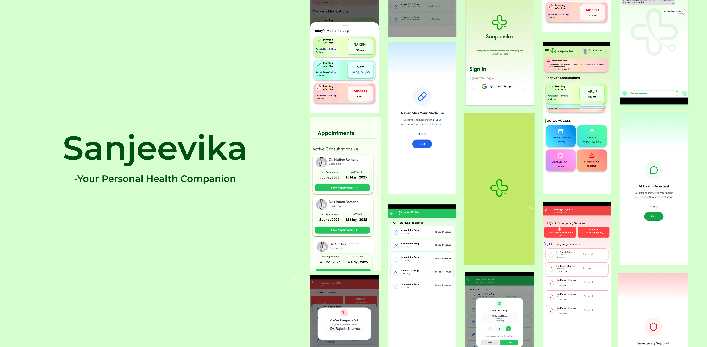

# 💙 Dr. Vaidya 
**Dr. Vaidya** is a Flutter-based mobile app designed for doctors and healthcare professionals to instantly access a patient's complete medical history using a unique code generated from the **Sanjeevika Patient App**. It securely fetches critical information like diseases, prescribed medicines, and emergency contacts from Firestore, enabling fast and informed medical decisions in clinics, hospitals, or emergency situations.

**[Download APK](https://drive.google.com/file/d/1XwU114HwW6INw5xIbgfn6qXqbb3zBJhE/view)** 

## 📱 App Preview

  

🔗 **Main GitHub Repository:**(https://github.com/Yashhh47/Vaidya-App)

## 👨‍💻 Meet Team Vaidya

A team of passionate developers from **IIIT Bhopal** , committed to transforming how healthcare is accessed, managed, and shared.

---
